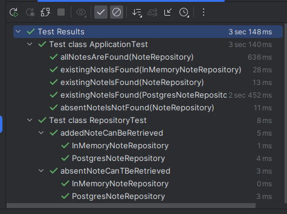

## Advanced Testing with Repositories

Sometimes I come into software projects, where developers struggle to deal with persistence
in automated testing. This repository contains some tricks and patterns that can be applied
to enable virtually any way to deal with persistence. Yet, it's just a very small amount of code necessary.

It uses

* Javalin as web framework, as it is lightweight, simple, explicit and fast. It can be instantiated oftentimes without any problems in tests.
* Testcontainers for efficient use of docker containers for real postgres databases in testing.
* Hikari for connection pooling (just to be more close to real world).
* AspectJ for some nice assertions.
* JUnit - the standard testing framework for the testing on the JVM. Its extension mechanism is
  key for achieving the desired results.

The tests in here make use of different repository implementations and test execution results can look like this:

_(I don't really know why the one ApplicationTest runs more than two seconds. It shouldn't take that much time, 
should rather be comparable to the RepositoryTest, some ms, not sure why there is such a big gap. I suspect it has
sth to do with what I do in the code, but not sure yet.)_

TODO: Link to not xet existing blog post here.